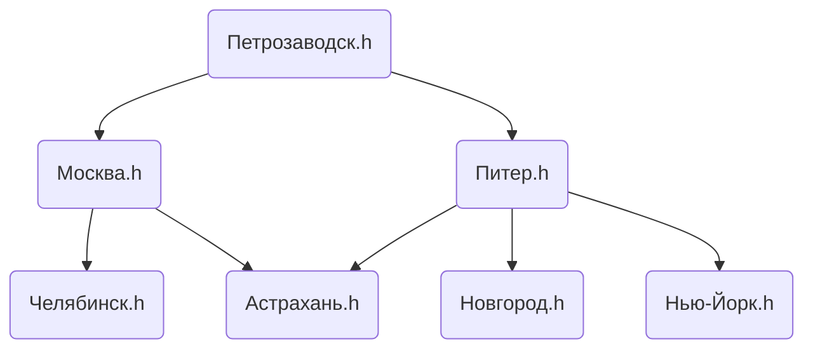

# Билет №1. Топологическая сортировка ориентированного графа.

**Краткое определение:** говорят, что ориентированный граф **без циклов** топологически отсортирован, если для любой дуги номер ее начала меньше номера ее конца.   
**Длинное определение:** Задача топологической сортировки графа состоит в следующем: указать такой линейный порядок на его вершинах, чтобы любое ребро вело от вершины с меньшим номером к вершине с большим номером. Очевидно, что если в графе есть циклы, то такого порядка не существует.

## Основные термины и обозначения

- **Граф** $G = (V, E)$ – это совокупность двух множеств: множества вершин $V$ и множества ребер $E$, состоящего из неупорядоченных пар различных элементов множества $V$: $E ⊂ ${ $ ( u, v ) | u, v ∈ V $};
- **Ориентированный граф** $G = (V, E)$ – это совокупность двух множеств: множества вершин $V$ и множества дуг $E$, состоящего из упорядоченных пар различных элементов множества $V$: $E ⊂ (V \times V) \ I, I =  $ { $ (v, v) | v \in V $ };
- **Обход графа в глубину**. Перебираем все исходящие из рассматриваемой вершины рёбра. Если ребро ведёт в вершину, которая не была рассмотрена ранее, то запускаем алгоритм от этой нерассмотренной вершины, а после возвращаемся и продолжаем перебирать рёбра. Возврат происходит в том случае, если в рассматриваемой вершине не осталось рёбер, которые ведут в нерассмотренную вершину. Если после завершения алгоритма не все вершины были рассмотрены, то необходимо запустить алгоритм от одной из нерассмотренных вершин;
- p - моменты времени захода в вершины (массив чисел);
- q - моменты времени выхода из вершин (массив чисел)

## Алгоритм топологической сортировки
1. Обойти граф в глубину.
2. Перебрать вершины графа в порядке убывания величины q[u].

## Псевдокод

Это псевдокод поиска в глубину

```python
dfs(v):     # На вход принимается вершина старта и номер компоненты связности
  print v  
  h[v] = BLACK # Помечаем вершину как пройденную
  t = t + 1    # Увеличиваем время
  p[v] = t     # Время захода в вершину v помечаем как t
  for u ∈ Γ(v) do        # Идём по всем детям этой вершины
    if h[u] = WHITE then # Если вершина ещё не пройдена
      dfs(u)          # То тоже проходимся по ней поиском в глубину
  t = t + 1    # Увеличиваем время
  q[v] = t     # Время выхода из вершины v помечаем как t
  yield return v # Возвращаем номер вершины
```

Псевдокод топологической сортировки:

```python
topologicalSort(g, v):   # Передаём граф без циклов и стартовую вершину
  for u ∈ Γ(v) do        # Идём по всем вершинам, начиная со стартовой
    if h[u] = WHITE then # Если вершина не пройдена
      answer += dfs(u)   # То проходимся поиском в глубину, ответ добавляем в конец к текущему
  print answer.reverse() # Выводим ответ в обратном порядке
```

## Пример 

Допустим, мы сборщик проектов. Мы разрабатывали проект для Весёлого молочника. Для каждого города - отдельный файл. Пришло время собирать проект. Нужно определить прядок включения всех файлов в сборщик. У нас есть список городов, в которые нужно доставить молоко. Доставляем мы молоко из столицы мира - Петрозаводска! Всего 6 городов, в которые надо доставить молоко: Москва, Питер, Челябинск, Астрахань, Нью-Йорк, Новгород. 



Пойдём по порядку.
1. Заходим в Петрозаводск p[Петрозаводск.h] = 1, q[Петрозаводск.h] = ???
2. Заходим в Москву p[Москва.h] = 2, q[Москва.h] = ???
3. Заходим в Челябинск p[Челябинск.h] = 3, q[Челябинск.h] = ???
4. Выходим из Челябинска p[Челябинск.h] = 3, q[Челябинск.h] = 4
5. Заходим в Астрахань p[Астрахань.h] = 5, q[Астрахань.h] = ???
6. Выходим из Астрахани p[Астрахань.h] = 5, q[Астрахань.h] = 6
7. Выходим из Москвы p[Москва.h] = 2, q[Москва.h] = 7
8. Заходим в Питер p[Питер.h] = 8, q[Питер.h] = ???
9. В Астрахани уже были, заходим в Новгород p[Новгород.h] = 9, q[Новгород.h] = ???
10. Выходим из Новгорода p[Новгород.h] = 9, q[Новгород.h] = 10
11. Заходим в Нью-Йорк p[Нью-Йорк.h] = 11, q[Нью-Йорк.h] = ???
12. Выходим из Нью-Йорка p[Нью-Йорк.h] = 11, q[Нью-Йорк.h] = 12
13. Выходим из Питера p[Питер.h] = 8, q[Питер.h] = 13
14. Выходим из Петрозаводска p[Петрозаводск.h] = 1, q[Петрозаводск.h] = 14

И так получаем порядок какой по q: Челябинск.h (4), Астрахань.h (6), Москва.h (7), Новгород.h (10), Нью-Йорк.h (12), Питер.h (13), Петрозаводск.h (14).
И теперь нужно развернуть, тогда и получим один из верных порядков инициализации проекта: Петрозаводск.h (первый), Питер.h (второй), Нью-Йорк.h (третий), Новгород.h (четвертый), Москва.h (пятый), Астрахань.h (шестой), Челябинск.h (седьмой).

## Временная сложность

Сложность времени такая же, как и у обхода в глубину, которая равна $O(V+E)$. 

---
## Создатель

Автор расписанного билета: Татьяна Квист

Кто проверил: 
- Смирнов Костя
- Курочкин Дима
- Топчий Евгений
- Лисицкий Олег

## Ресурсы
- [Вики](https://ru.wikipedia.org/wiki/%D0%A2%D0%BE%D0%BF%D0%BE%D0%BB%D0%BE%D0%B3%D0%B8%D1%87%D0%B5%D1%81%D0%BA%D0%B0%D1%8F_%D1%81%D0%BE%D1%80%D1%82%D0%B8%D1%80%D0%BE%D0%B2%D0%BA%D0%B0)
- [Хабр | Топологическая сортировка](https://habr.com/ru/post/100953/)
- [Хабр | ОБходы графа](https://habr.com/ru/post/504374/)
