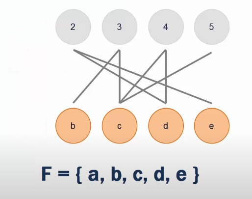
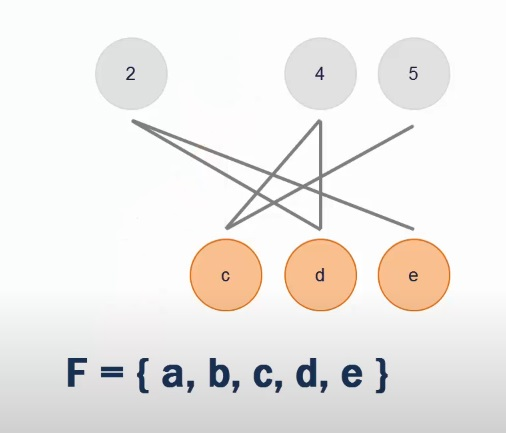
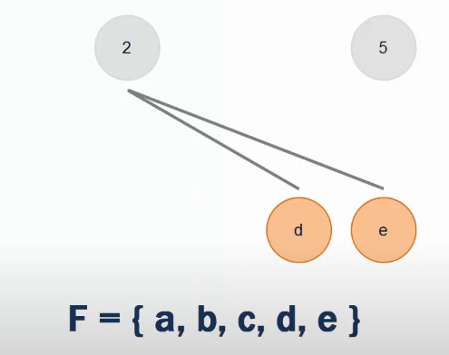
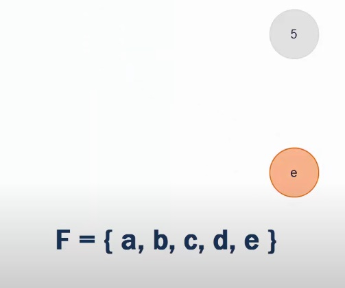
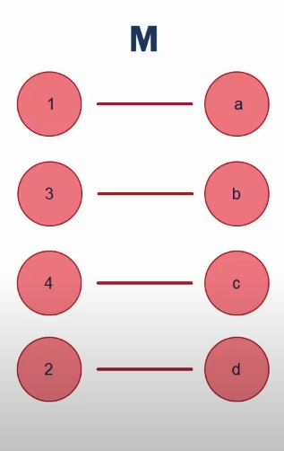
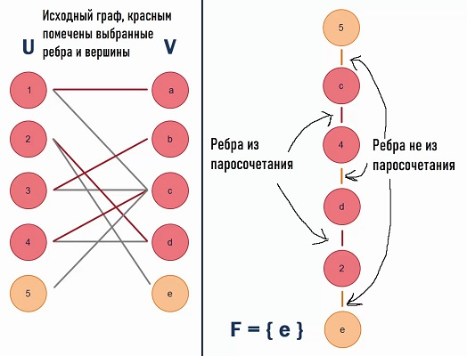
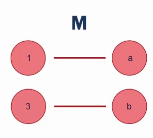
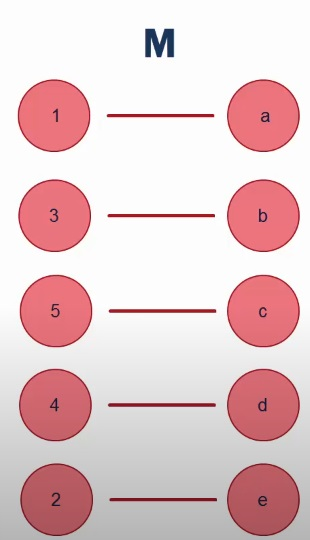

# Билет №10. Максимальное паросочетание. Алгоритм Хопкрофта – Карпа.

- **Краткое определение:** максимальный набор попарно несмежных ребер.
- **Длинное определение:** задача поиска максимального набора ребер графа, попарно несмежных между собой.
## Основные термины и обозначения

- **Граф** $G = (V, E)$ – это совокупность двух множеств: множества вершин $V$ и множества ребер 
$E$, состоящего из неупорядоченных пар различных элементов множества $V$: 
$E ⊂ \lbrace ( u, v ) | u, v ∈ V \rbrace $;

- **Паросочетание** - подмножество ребер графа $G$, в котором никакие два ребра не смежны.
- **Наибольшее паросочетание** - максимальное подмножество ребер, образующих паросочетание.
- **Полное паросочетание** – паросочетание, в котором для любой вершины графа найдется инцидентное ей ребро. (очевидно, что оно является наибольшим)


## Введение в билет

Есть граф $G = (V, E)$, в нем необходимо найти максимальное паросочетание. Делать это можно по-разному, например "в лоб" (сгенерировать все паросочетания и выбрать то, в котором больше всего ребер - время работы в таком случае будет экспоненциально зависеть от числа вершин в графе), но многие более эффективные алгоритмы используют *чередующиеся цепи*.

**Парная вершина** - вершина, инцидентная ребру из паросочетания $M$.

**Чередующаяся цепь** - путь в двудольном графе, для любых двух соседних рёбер которого верно, что одно из них принадлежит паросочетанию $M$, а другое нет.
- Паросочетание $M$ можно увеличить, если удалить из него ребра, входящие в чередующуюся цепь P, и добавить ребра цепи P, которых в паросочетании $M$ не было. Новое паросочетание обозначается $M \Delta P$.

## Алгоритм

- Шаг 1. M = ∅
- Шаг 2. Если относительно M не существует чередующейся цепи, то M – наибольшее паросочетание, стоп.
- Шаг 3. Находим P – чередующуюся цепь относительно M.
- Шаг 4. M := M∆P.
- Шаг 5. Переход на шаг 2.

Понятно, что сложность во 2 и 3 шаге. Рассмотрим их на примере двудольного графа (**Алгоритм Хопкрофта-Карпа** работает только для таких).

- Поиск в ширину (**BFS**) разбивает вершины графа на слои. BFS начинает с множества свободных вершин $U$, которые тем самым образуют первый слой разбиения (таким образом, первый слой содержит только не покрытые паросочетанием рёбра). На последующих уровнях поиска алгоритм добавляет вершины на новый уровень, чередуя рёбра: будет попеременно добавлять вершины, связанные ребром то в паросочетании, то вне его, поэтому в процессе поиска из вершины из $U$ мы всегда будем проходить по рёбрам не из паросочетания, а если вершина из $V$ — то наоборот. Поиск прерывается на уровне $k$, как только впервые будет достигнута хотя бы одна свободная вершина из $V$.
- Все свободные вершины из $V$ на этом слое $k$ обозначим как $F$. Получается, вершина $v$ принадлежит $F$ тогда и только тогда, когда в ней кончается кратчайший удлиняющий путь.
- Алгоритм находит максимальное множество непересекающихся по вершинам путей длины $k$. Это множество может быть найдено поиском в глубину (**DFS**), который использует найденное ранее разбиение на слои. Поиск может проходить лишь по рёбрам, которые ведут в неиспользованные вершины предыдущего слоя, и путь в дереве поиска в глубину должен чередоваться относительно паросочетания $M$. Как только увеличивающий путь войдёт в одну из вершин $F$, следует начать DFS от следующей вершины.
- Каждый из путей, который будет найден, используется для увеличения $M$.


## Псевдокод
```python
/* 
 G = U ∪ V ∪ {NIL}
 where U and V are partition of graph and NIL is a special null vertex
*/
  
function BFS ()
    for u in U
        if Pair_U[u] == NIL
            Dist[u] = 0
            Enqueue(Q,u)
        else
            Dist[u] = ∞
    Dist[NIL] = ∞
    while Empty(Q) == false
        u = Dequeue(Q)
        if Dist[u] < Dist[NIL] 
            for each v in Adj[u]
                if Dist[ Pair_V[v] ] == ∞
                    Dist[ Pair_V[v] ] = Dist[u] + 1
                    Enqueue(Q,Pair_V[v])
    return Dist[NIL] != ∞

function DFS (u)
    if u != NIL
        for each v in Adj[u]
            if Dist[ Pair_V[v] ] == Dist[u] + 1
                if DFS(Pair_V[v]) == true
                    Pair_V[v] = u
                    Pair_U[u] = v
                    return true
        Dist[u] = ∞
        return false
    return true

function Hopcroft-Karp
    for each u in U
        Pair_U[u] = NIL # у вершин из U пар пока нет
    for each v in V
        Pair_V[v] = NIL # у вершин из V тоже
    matching = 0 # начали с нулевого паросочетания
    while BFS() == true # пока BFS находит пути из U в V
        for each u in U
            if Pair_U[u] == NIL #если у вершины еще нет пары
                if DFS(u) == true # ищем ей пару через DFS
                    matching = matching + 1 # если нашли, то это чередующаяся цепь, увеличили паросочетание
    return matching
```

## Пример
Имеем исходный граф.


Ищем пути из вершин $U$ в вершины $V$ при помощи **BFS** (граф имеет всего 2 слоя, т.к. нет выбранных ребер и вершин). Поднимаемся из первой вершины в $V$ при помощи **DFS**. Ребро, по которому поднимались включаем в паросочетание (изначально пустое).


То же самое повторяем для оставшихся вершин.







Из вершины $e$ пути в вершину 5 нет.



Паросочетание имеет вид



Ищем путь из невыбранных вершин $U$ в невыбранные вершины $V$ **BFS**-ом (чередуя ребра из паросочетания и вне его). Поднимаемся обратно по слоям с **DFS**



Удаляем из паросочетания ребра, которые есть в последнем пути ($c-4$ и $d-2$)



Добавляем ребра, которых в нем не было ($c-5$, $d-4$ и $e-2$). Дальше не идем, т.к. задействованы все вершины. Итоговое паросочетание имеет вид: 




## Доказательство корректности работы алгоритма
Пусть P – чередующаяся цепь относительно M. Тогда M\' = M $\Delta$ P будет паросочетанием, для которого |M\'| = |M| + 1.

**Лемма Бержа** - Паросочетание $M$ наибольшее тогда и только тогда, когда не существует чередующейся цепи относительно него. 
Для доказательства этого свойства достаточно показать, что если в графе $G$ найдутся два паросочетания $M$ и $N$, для которых |M$| < |N$|, то в графе, образованном из ребер множества $M \Delta N$ найдется чередующаяся цепь относительно $M$.

Действительно, компонентами связности графа $M \Delta N$ являются простые цепи и простые циклы, в которых чередуются ребра из $M$ и $N$. В циклах одинаковое число ребер из $M$ и $N$. Среди цепей обязательно найдется такая, что ребер из $N$ будет на одно больше, чем ребер из $M$. Она и будет чередующейся цепью относительно $M$.

## Временная сложность 
На каждом шаге имеем BFS и DFS, по $O(E)$ каждый,
В худшем случае имеем $2 \sqrt{V}$ шагов
(первые $\sqrt{V}$ шагов пройдут за $O(E \cdot \sqrt{V})$; кратчайший из чередующихся путей относительно M имеет длину 
$\sqrt{V}$, симметрическая разность (тот же XOR) оптимального паросочетания и текущего паросочетания M, найденного в предыдущих фазах, образует множество вершинно 
непересекающихся увеличивающих путей и чередующихся циклов. Если каждый путь имеет длину, по крайней мере, $\sqrt{V}$
, может быть не более чем $\sqrt{V}$ путей,
размер оптимального паросочетания отличается от $M$ не более
, чем на $\sqrt{V}$
, т.е. осталось не более, чем $\sqrt{V}$ шагов ), 
Значит алгоритм Хопрофта-Карпа работает за $O(E \cdot \sqrt{V})$ времени.

Несмотря на это, для разреженного двудольного графа алгоритм в среднем работает за $O(E \cdot \log _{} V)$

---
## Создатель

Автор расписанного билета: Николай Беленков

Кто проверил: 


## Ресурсы
- [Вики](https://ru.wikipedia.org/wiki/%D0%90%D0%BB%D0%B3%D0%BE%D1%80%D0%B8%D1%82%D0%BC_%D0%A5%D0%BE%D0%BF%D0%BA%D1%80%D0%BE%D1%84%D1%82%D0%B0_%E2%80%94_%D0%9A%D0%B0%D1%80%D0%BF%D0%B0)
- [А.В. Ахо, Д.Э. Хопкрофт, Д.Д. Ульман - Структуры данных и алгоритмы](https://moodle2.petrsu.ru/mod/resource/view.php?id=47310)
- [Видео на YouTube](https://www.youtube.com/watch?v=CSUEVu-qUgM)
