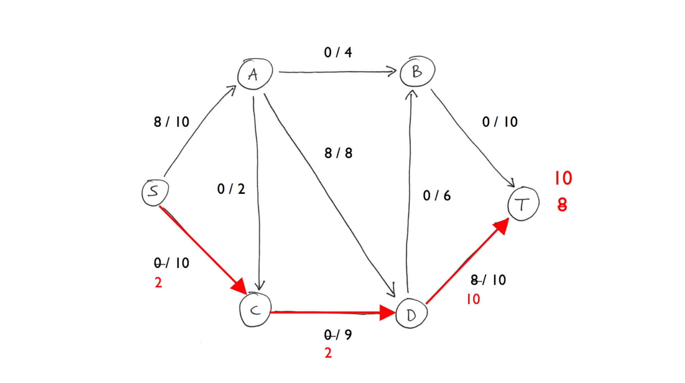

# Билет №11. Потоки в сетях. Алгоритм Форда – Фалкерсона.

**Определение:** В теории оптимизации и теории графов, задача о максимальном потоке заключается в нахождении такого потока по транспортной сети, что сумма потоков из истока, или, что то же самое, сумма потоков в сток максимальна.

## Основные термины и обозначения
- **Сеть** - Назовем сетью ориентирванный граф G = (V, E), каждому ребру (u, v) ∈ E которого поставлено в соответствие число c(u, v) ≥ 0 , называемое пропускной способостью ребра.  
- **Поток** - Пусть дана сеть G = (V, E), имеющая начальную вершину(далее исток) s, конечную вершину (далее сток) t и функцию, задающую пропускную способность, с. Поток сети G – это функция f : V × V → R, удовлетворяющая следующим условиям:  
1) Ограничение пропускной способности: ; f (u, v) ≤ c(u, v) для ∀v, u ∈ V  
2) Кососимметричность: f (u, v) = −f (v, u), для ∀v, u ∈ V ⇒ f (u, u) = 0 ∀u ~ входящий поток равен исходящему.  
3) Сохранение потока P v∈V f (u, v) = 0 для ∀u ∈ {V \ {s,t}}  
- **Величина потока** - Величина потока f – это P v∈V f (s, v) и обозначается как |f|.
- **Алгоритм Форда – Фалкерсона** - Алгоритм поиска максимального потока.

## Задача о максимальном потоке  
Дана сеть G, с истоком s и стоком t. Требуется найти поток максимальной величины.  
- Остаточная пропускная способность сети из u в v - это $c_f$(u, v) = c(u, v) − f (u, v)  
- Остаточная сеть - Сеть $G_f$ (V, $E_f$ ), где $E_f$ = {(u, v) ∈ V × V : $c_f$ (u, v) > 0}, называется остаточной сетью сети G, порожденной потоком f . Её ребра называются остаточными.

## Алгоритм Форда – Фалкерсона

 - Идея
Будем проводить поиск максимального потока последовательно. Вначале поток нулевой. На каждом шаге мы увеличиваем значение потока. Для этого мы находим дополняющий путь, по которому мы можем пустить еще немного потока, и используем его для его увеличения. Этот шаг повторяется, пока есть дополняющие пути. Полученный поток будет максимальным.  
*Дополняющие пути - Назовем дополняющим путем простой путь из истока в сток в остаточной сети $G_f$.  

## Псевдокод

```python
Ford-Fulkerson(G, s, t)
 for (u, v) ∈ E do # Изначально по каждому ребру нулевой поток
  f [u, v] = 0
  f [v, u] = 0
 while в Gf существует путь p из s в t do # Если еще остались не полностью насыщенные ребра из истока в сток (существует путь)
  cf (p) = min{cf (u, v) : (u, v) ∈ p} # Пускаем поток, можно пустить не больше, чем проп. способность самого маленького ребра
  for (u, v) ∈ p do # Для каждого ребра изменяем значения текущего потока (сколько уже проходит)
   f [u, v] = f [u, v] + cf (p)
   f [v, u] = −f [u, v] 
```

## Пример 
1. Найти путь от истока к стоку(любой)
2. Высчитываем поток исходя вместимости(пускаем по пути поток максимально возможный поток)
3. Проделываем это до тех пор, пока из истока мы больше не сможем направить больший поток.

Берем путь, пропускаем по нему поток, тут мы можем пропустить максимум 8, т.к. пропускная способность A--D = 8

Берем другой путь, по пути S--C--D пропускаем 2, т.к. в D уже идет поток равный 8 из A, а его максимальная пропускная способность в исток равна 10.

Берем другой путь, теперь по пути S--C--D пропускаем 6, т.к. часть потока из A в D, равную 4, мы возвращаем обратно в A, и уже эту часть потока пускаем по A--B

Берем другой путь, S--D пускаем еще 2, следовательно из A--D ,будет передаваться 6 из 8 возможных, по D--B передаем 2, следовательно по B--T можно передать 6 из 10 

По S--C--D передаем 9 из 10, по D--B передается 5 из 6, следовательно по B--T можно передать 9 из 10

Тут уже не возможно найти путь, по которому можно передать больше потока, чем уже есть, следовательно максимальный поток равен 19


Крайне рекомендуем посмотреть это видео для полного понимания - (https://www.youtube.com/watch?v=Tl90tNtKvxs)

## Временная сложность

Время работы алгоритма зависит от алгоритма поиска дополняющего пути р. Для его нахождения можно воспользоваться обходом в глубину или ширину. В итоге инициализация потребует O(E). Цикл while выполняется не более |f*| раз, где f* - максимальный поток. Поиск дополняющего пути в остаточной сети займет время O(E).  
- Поэтому время работы алгоритма будет O(E|f*|).

## Создатель

Автор расписанного билета: Топчий Женя и Смирнов Костя

Кто проверил: 

## Ресурсы
Презентаха Воронова (https://moodle2.petrsu.ru/mod/resource/view.php?id=70351)
 
