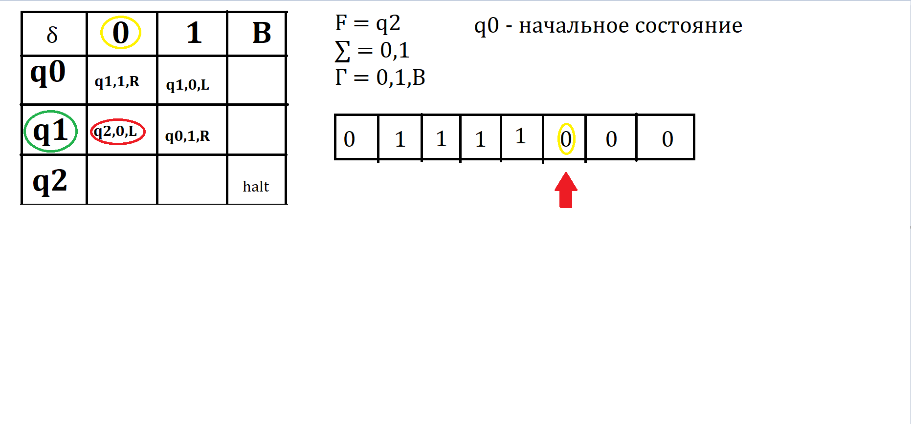
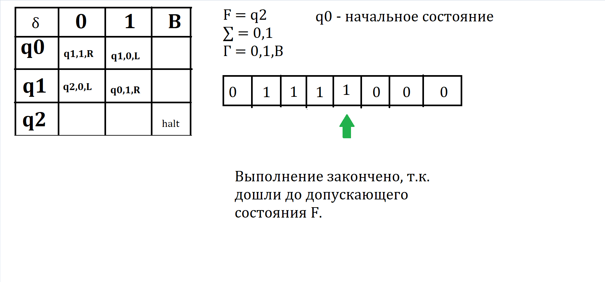

# Билет №17. Машина Тьюринга. Разрешимость алгоритмических проблем. 

**Машина Тьюринга:** 
- Машина состоит из *конечного управления*, которое может находится в любом из конечного множества состояний.  
- У машины есть *конечная лента*, разбитая на некоторое число число *ячеек*. Каждая ячейка может хранить любой символ из конечного алфавита.  
- В процессе работы могут добавляться новые ячейки, как справа, так и слева, поэтому лента потенциально бесконечна.  
  
- Изначально на ленте записан вход, представляющий собой цепочку сиволов конечной длины. Символы на ленте выбираются из конечного алфавита.  
- Остальные ячейки содержат пустой символ (на примере буква B).  
- Пустой символ не является входным сиволом.  
- Ленточная головка всегда устанавливается на какой-то ячейке ленты (какой-то из символов $a_1 ... a_n$). Такая ячейка называется обозреваемой.  
- Изначально обозревается самая левая ячейка, содержащая входной символ.  

**Переход машины Тьюринга** - Это функция, зависящая от состояния конечного управления и обозреваемого символа. За один переход МТ выполняет следующие действия:  
1) Изменение состояния (может совпасть с текущим)  
2) Запись ленточного символа (пустого символа(B)) в обозреваемую ячейку.  
3) Сдвиг головки влево или вправо.  
В множестве состояний конечного управления выделяют так называемые допускающие состояния.  
*Машина Тьюринга останавливается, если конечное управление находится в допускающем состоянии*

**Задание Машины Тьюринга**

Машина Тьюринга задается как семерка M = (Q, Г, ∑, δ, q0, B, F), где: 
- Q - конечное множество состояний конечного управления;  
- Г - конечное множество ленточных символов;  
- ∑ - конечное множество входных символов $∑ \subset Г$;  
- δ - множество переходов $ \delta : Q \times Г \rightarrow Q \times Г \times  \lbrace{L, R}\rbrace$, где $L, R$ направление сдвига головки;  
- q0 - начальное состояние, в котором управление находится в начале, $q_0 \in Q$;  
- B - пустой символ, $B \in Г \textbackslash ∑$;  
- F - множество допускающих состояний, $F \subset Q$;  

**Определение**

Частичная функция $F$ вычислима на Машине Тьюринга, если для любого $x$ эта машина, стартуя из состояния, в котором на ленте записан вход $x$ , управляющее устройство находится в состоянии q0, ленточная головка указывает на первую ячейку и  
1) остановится в допускающем состоянии и на ленте записано $f(x)$, если $f(x)$ определено;  
2) не останавливается или останавливается в недопускающем состоянии, если $f(x)$ неопределено;  

**Теоремы**
1) Тезис Тьюринга - класс вычислимых частичных функций совпадает с классом всех частичных функций, вычислимых на машине Тьюринга.
2) Теорема - класс частично рекурсивных функций совпадает с классом числовых функций, вычислимых на машине Тьюринга.

## Пример
Мы поставили курсор произвольно)

## Создатель

Автор расписанного билета: Смирнов Константин, Беленков Николай, Топчий Евгений

Кто проверил:

## Ресурсы
- Презентация Воронова(https://moodle2.petrsu.ru/mod/resource/view.php?id=47302) 46-54 слайды
