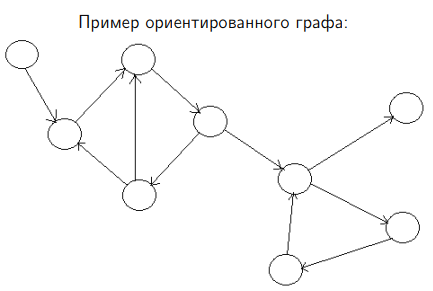
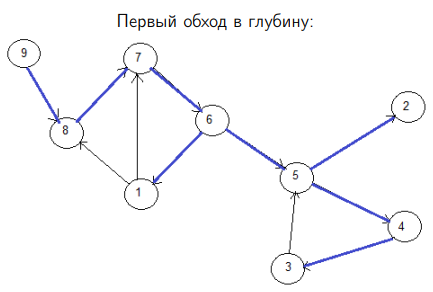
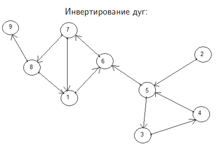
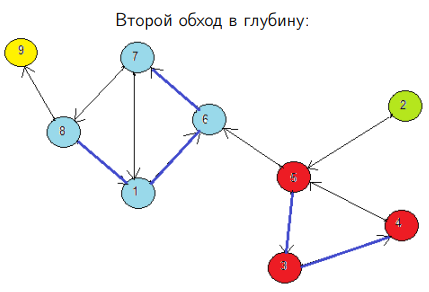
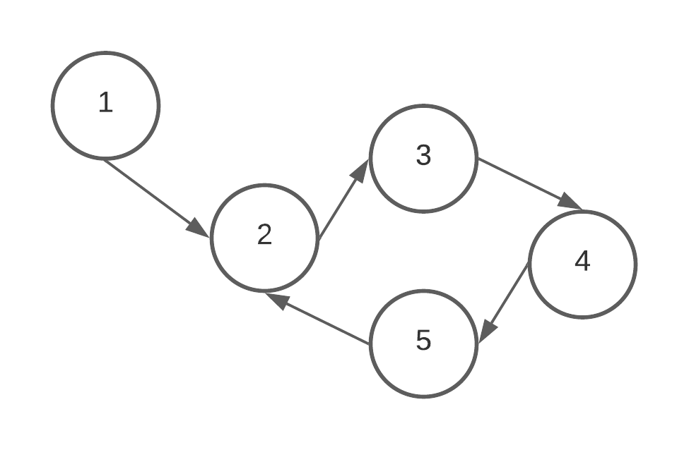

# Билет №2. Определение компонент сильной связности ориентированного графа.

**Краткое определение:** компоненты сильной связности (КСС) орграфа – это его максимальные сильно связные подграфы.

**Длинное определение:** говорят, что вершины $u$ и $v$ сильно связаны, если существует путь из $u$ в $v$ и из $v$ в $u$. Компонента сильной связности - это максимальный набор сильно связанных между собой вершин. В орграфе может быть несколько КСС.

## Основные термины и обозначения

- **Граф** $G = (V, E)$ – это совокупность двух множеств: множества вершин $V$ и множества ребер $E$, состоящего из неупорядоченных пар различных элементов множества $V$: 
$E ⊂ ${ $ ( u, v ) | u, v ∈ V $};
- **Ориентированный граф** $G = (V, E)$ – это совокупность двух множеств: множества вершин $V$ и множества дуг $E$, состоящего из упорядоченных пар различных элементов множества $V$: 
$E ⊂ (V \times V) \ I, I =  \lbrace (v, v) | v \in V \rbrace $;
- **Обход графа в глубину**. Перебираем все исходящие из рассматриваемой вершины рёбра. Если ребро ведёт в вершину, которая не была рассмотрена ранее, то запускаем алгоритм от этой нерассмотренной вершины, а после возвращаемся и продолжаем перебирать рёбра. Возврат происходит в том случае, если в рассматриваемой вершине не осталось рёбер, которые ведут в нерассмотренную вершину. Если после завершения алгоритма не все вершины были рассмотрены, то необходимо запустить алгоритм от одной из нерассмотренных вершин;
- **Сильно связанные вершины** - вершины  $u$ и $v$ сильно связаны, если существует путь из $u$ в $v$ и из $v$ в $u$ (туда-сюда).
- **Компонента сильной связности** - это максимальный набор сильно связанных между собой вершин.
- **Лемма о белом пути** - не существует такого момента выполнения поиска в глубину, в который бы существовало ребро из черной вершины в белую. (не существует пути из посещённой вершины в непосещённую при обходе в глубину) [Инфа из вики](https://neerc.ifmo.ru/wiki/index.php?title=Лемма_о_белых_путях#:~:text=◃-,Утверждение%3A,пути%20в%20первый%20момент%20времени.)
- g[] - моменты времени выхода из вершин графа.


## Алгоритм Косарайю (Косарайю – Шарира) поиска КСС орграфа G

1. Обойти граф G в глубину.
2. Получить граф G'  путем обращения стрелок на дугах графа G.
3. Обойти граф G', вызывая обход в глубину в порядке убывания величин g[u] (моменты времени выхода из вершин), полученных на первом шаге.
4. Полученные деревья обхода в глубину соответствуют КСС исходного графа G.


|  |
|:--:|
|  |
| <b>1. Обойти граф G в глубину.</b>|
|  |
| <b>2. Получить граф G'  путем обращения стрелок на дугах графа G.</b>|
|  |
| <b>3. Обойти граф G', вызывая обход в глубину в порядке убывания величин g[u] (моменты времени выхода из вершин), полученных на первом шаге.</b>| 
 
Полученные деревья обхода в глубину соответствуют КСС исходного графа G.

### Псевдокод

G - исходный граф  
G' - инвертированный граф 

```python
# Обход в глубину
function dfs(v):          # Передаём стартовую вершину                                         
    h[v] = BLACK          # Помечаем первую вершину как пройденную
    for (v, u) in E       # Идём по всем ребрам
        if not visited[u] # Если вторая вершина в этом ребре не посещена
            dfs(u)        # Проходимся по ней поиском в глубину
    g += v              # Добавляем вершину v в конец списка g
    yield return g      # Возвращаем порядок выхода из вершин
 
# Обход в глубину инвертированного графа
function dfsInv(v, k):                                          
    component[v] = k                                          # Назначаем вершине номер её КСС                       
    for (v, u) in E                                           # Проходимся по всем рёбрам
        if (вершина u еще не находится ни в какой компоненте)                       
            dfsInv(G'[v], k)                                   # Делаем обход в глубину от этой вершины
 
function main():
    считываем исходные данные, формируем массивы G и G', 
    for u in V            # Идём по всем вершинам                           
        if h[u] = WHITE   # Если вершина ещё не обработана
            g += dfs(u)   # Проходимся поиском в глубину и добавляем моменты времени из вершин
    
    k = 1 # Счётчик компонент
    foreach u in g.reverse()                              # Обходим вершины по уменьшению момента времени выхода                                               
        if (вершина u не находится ни в какой компоненте) 
            dfsInv(u, k)                                  # Делаем обход в глубину от этой вершины, передавая номер КСС
            k++                                           # Прибавляем 1 к счётчику КСС
```

### Доказательство работы алгоритма Косарайю
**Утверждение.** Вершины $u$ и $v$ принадлежат одной КСС графа $G$ тогда и только тогда, когда они будут в одном дереве леса обхода в глубину графа $G'$.

1. Пусть вершины $u$ и $v$ принадлежат одной КСС. Тогда они будут в одном дереве леса обхода в глубину графов $G$ и $G'$ (следует из теоремы о белом пути).
2. Покажем, что если вершины находятся в одном дереве леса обхода в глубину графа $G'$, то они находятся в одной КСС графа $G$. Пусть вершины u и v находятся в одном дереве леса обхода в глубину графа $G'$ с корнем $x$. **Докажем, что $u$ сильно связна с $v (u ∼ v)$. Для этого докажем, что $u ∼ x$.**  
3. Так как $u$ – потомок $x$ в дереве $G'$, то существует путь из $u$ в $x$ в графе $G$.  
4. Имеем $q[u] < q[x]$.   

Применим метод от противного. Пусть не сущетвует пути из $x$ в $u$ в $G$. Тогда при обходе в глубину графа $G$ возможно два случая:
1. вершина $x$ посещается раньше, чем $u$, тогда $q[u] > q[x]$ – противоречие;
2. вершина $u$ посещается раньше, чем $x$. В силу наличия пути из $u$ в $x$ в графе $G$ возьмем у этого пути первую посещенную вершину $w$. Тогда $q[w] > q[x]$. Но $w$ – потомок $x$ в дереве при обходе $G'$ – противоречие.

Cледовательно, существует путь из $x$ в $u$. Аналогично можно показать, что $v ∼ x$. По транзитивности получаем, что $u ∼ v$. **Утверждение доказано**.

### Временная сложность

В алгоритме проводится 2 обхода в глубину, время одного обхода в глубину - O(V + E). 
- Тогда оценка работы алгоритма снизу будет: $\Theta (V + E) * 2 = \Theta (V + E)$
- Оценка сверху - обход в глубину при полном графе (колчество рёбер в полном грае = n*(n-1)/2, где n - количество вершин). Тогда оценка алгоритма сверху будет равна: $O(V + V * (V - 1) / 2) = O(V^2)$

## Алгоритм Тарьяна поиска КСС

  1. Обойти граф в глубину. При посещении вершины помещать ее в стек.
  2. При выходе из вершины v проверить, есть ли у нее предок u, к которому ведет какой-нибудь путь из вершины v, состоящий из любого числа дуг дерева и перекрестных дуг, заканчивающийся обратной дугой (назовем такой путь обратным).
  3. Если такой вершины u нет, то извлекать из стека вершины, пока не встретится вершина v. Все они образуют одну КСС.


### Псевдокод
**Обозначения:**
- κ – номера компонент сильной связности
- p – моменты времени захода в вершины
- S – стек
- µ – признак нахождения вершины в стеке
- t – счетчик времени
- Г() - матрица смежных вершин
- x - массив, где индексом является номер вершина, а знаачением номер компонента сильной связности

- λ[v] минимум чисел:
  - p[v];
  - p[w], где w – предок вершины v, к которому
    ведет обратный путь из вершины v.

 ```python
dfs(v)
    S.push(v)                # Добавляем вершину в стек
    t = t + 1                # Обновляем время
    λ[v] = p[v] = t          # Устанавливаем начальные значения
    µ[v] = true              # Ставим флаг, что вершина в стеке
    
    for u ∈ Γ(v) do                # Проходимся по всем вершинам
        if p[u] = 0 then           # Если второй конец ребра не посещался
            dfs(u)                 # Выполняем поиск в глубину для второго конца
            λ[v] = min{λ[v], λ[u]} # Обновляем значение λ, это нужно, чтобы определить, является ли эта вершина последней точкой текущей КСС 
        
        else if µ[u] then          # Если второй конец  в стеке
            λ[v] = min{λ[v], p[u]} # Обновляем значение λ, по тем же причинам
    
    if p[v] = λ[v] then      # Если момент времени входа в вершину совпадает со значением λ для этой вершины
        k = k + 1            # Обновляем счётчик КСС 
        do                      
            u = S.pop        # Вытаскиваем последнюю вершину из стека
            x[u] = k         # Присваиваем ей номер КСС
            µ[v] = false     # Убираем флаг, что вершина в стеке
        while u != v         # Повторяем до тех пор, пока последней вершиной стеке не будет рассматриваемая вершина
 ```
 
 Запуск алгоритма
 
 ```
for v ∈ V do      # Для всех вершин в графе
    p[v] = 0      # Момент времени входа равен 0

t = 0             # Время равно 0
k = 0             # Счётчик КСС равен 0

for v ∈ V do         # Для всех вершин в графе
    if p[v] = 0 then # Если момент времени входа равен 0 (она не посещалась)
        dfs(v)       # Выполнить поиск в глубину

 ```
 
### Доказательство работы

 Нужно доказать:
 
  1. Будут найдены все вершины КСС.
  2. В КСС не будут вписаны вершины другой КСС.

 При обходе в глубину, выход из дочерних вершин всегда заканчивается раньше, чем из вершин родителей. Тогда:
  
  1. Если в дочерней вершине есть обратное ребро, то его $λ[v]$ обновится и не будет равна 
$p[v]$, поэтому она останется в стеке, при этом, если вершина является частью обратного пути, 
но не является вершиной с обратной дугой, то при выходе из дочерней вершины сработает условие 
$λ[v] = min \lbrace λ[v], λ[u] \rbrace $
, и её 
$λ[v]$ не будет равна 
$p[v]$ и она останется в стеке, это будет продолжатся, пока алгоритм не выйдет обратно к вершине предку, к которой ведёт обратный путь, там вершины будут вынуты из стека и приписаны к одной КСС. Это значит что **будут найдены все вершины КСС**.
 
  2. Если в ходе обхода в глубину, будет найдена другая КСС, то её вершины будут вынуты из стека раньше, чем вершины первой КСС, потому что если это другая КСС, то поскольку мы пришли в эту КСС из вершины с первой КСС, то первая найденная вершина этой КСС будет для неё дочерней, значит обход в глубину для неё закончится раньше и все вершины этой КСС будут вынуты из стека перед выходом. Это значит, что **в КСС не будут вписаны вершины другой КСС**.

### Временная сложность
 
 Алгоритм работает за один обход в глубину, значит оценка равна: $O(V + E) \cdot 2 = O(V + E)$
 
 ### Пример

Есть граф



Начнём обход в глубину с вершины 1. В итоге получим:

.png)

Из вершины 5 мы можем попасть в верршину-предка пол номером 2, это значит, что весь путь от 2 до 5 - одна КСС. После мы продолжаем выполнять поиск в глубину и получаем такую картину:

.png)

Из вершины один больше нет никаких путей, значит вершина 1 - это вторая КСС в графе, значит поиск в глубину окончен. В итоге в графе нашлось две компоненты связности.

.png)
 
## Создатель

Автор расписанного билета: Курочкин Дима

Кто проверил:
- Квист Татьяна
- Лисицкий Олег
- Топчий Женя
- Смирнов Костя
## Ресурсы

 - [Презентация Воронова, слайды 47-60](https://moodle2.petrsu.ru/mod/resource/view.php?id=47301).
 - [Лемма_о_белых_путях](https://neerc.ifmo.ru/wiki/index.php?title=Лемма_о_белых_путях#:~:text=◃-,Утверждение%3A,пути%20в%20первый%20момент%20времени.)
