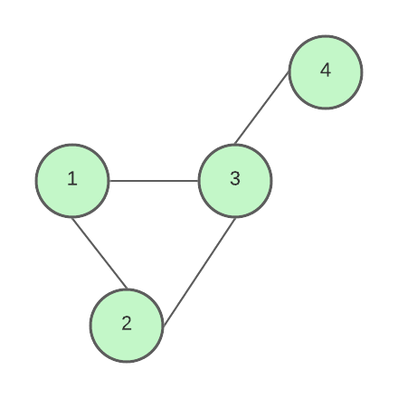
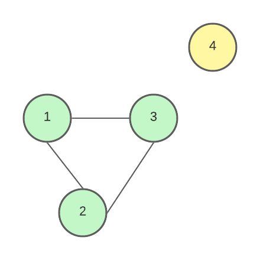
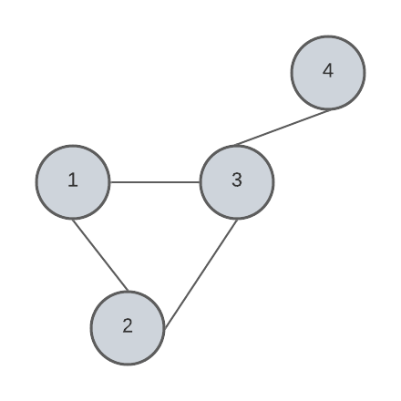
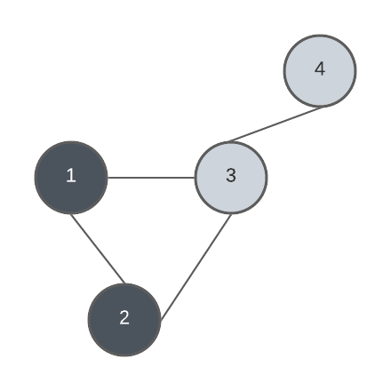
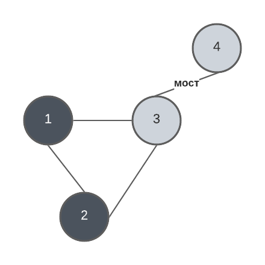
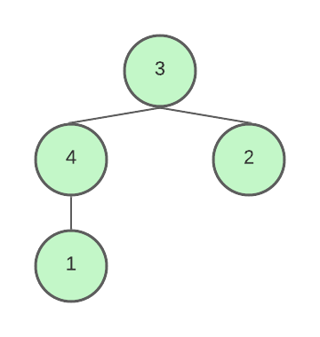
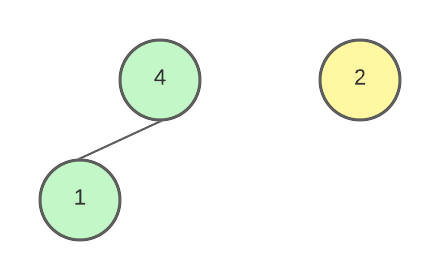
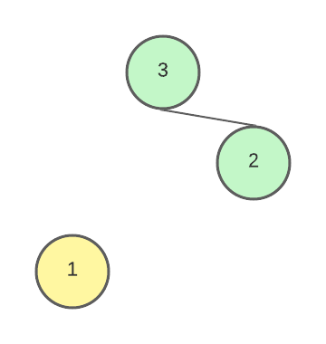
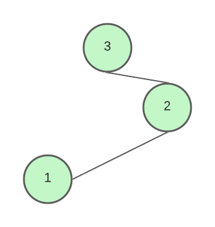

# Билет №3. Поиск мостов. Поиск точек сочленения.

**Кратое описание**: Мост -  ребро, удаление которого увеличивает число компонент связности. Точка сочленения – вершина, удаление которой увеличивает число компонент связности.

## Важные штуки

**Переменные используемые при обходе в глубину:**

p[v] - момент времени входа в точку v

λ[v] - минимум чисел:
1) p[v];
2) p[w], где w – предок вершины v, для которого существует обратное ребро (x, w), в котором x – потомок вершины v.

λ[v] может принимать одно из трёх значений:
 1) p[v].
 2) λ[u] всех детей u вершины v.
 3) p[w] всех w, для которых существует обратное ребро (v, w).

Обратное ребро - ребро , соединяющие вершину с её предком в дереве обхода в глубину назовем обратными ребрами (для неориентированного графа предок должен быть не родителем, так как иначе ребро будет являться ребром дерева (к примеру, в первой картинке 4-3 не является обратным ребром)).
## Мосты

Мост -  ребро, удаление которого увеличивает число компонент связности.

К примеру дан граф:



В нём одна КСС. Но если удалить ребро  3-4. То получится граф с 2 КСС. Это значит, что ребро 3-4 является мостом.



### Псевдокод

```python
dfs(w, v)                      # Поиск в глубину
    h[v] = BLACK                  # Отмечаем текущую точку посещённой
    t = t + 1                     # Обновляем время
    λ[v] = p[v] = t               # Устанавливаем значения λ и момент времени входа в точку (p)
    for u ∈ Γ(v) do               # Для всех рёбер этой вершины
        if h[u] = WHITE then         # Если второй конец ребра не посещён
            dfs(v, u)                   # То выолнить поиск в глубину для него
            λ[v] = min{λ[v], λ[u]}      # После обновить значние λ
        else if (u != w)             # Иначе, если второй конец был посещён и он не является родителем (проверку на родителя я добавил сам, т.к. без неё работать не должно, может ошибаюсь, проверьте на всякий случай)
            λ[v] = min{λ[v], p[u]}      # Обновить значение λ
    if w > 0 and p[v] = λ[v] then # Если у этой вершины был предок (w > 0) и p совпадает λ для этой вершины
        (w, v) – мост

```

Запуск алгоритма

```python
for v ∈ V do
    h[v] = WHITE        # Отмечаем все вершины непосещёнными
t = 0                # Обнуляем время
for v ∈ V do
    if h[v] = WHITE then # Если вершина не посещена
        dfs(0, v)            # Выполнить для неё посиск в глубину
```

**Пример**

Дан граф


Начнём поиск в глубину с вершины 4. От 4 мы придём к 3, от 3 к 1, от 1 ко 2. В итоге будет такая картина:



Серые вершины - вершины, в которых начался обход в глубину, но ещё не закончился. На данный момент:

$p_{1} = 3 \ λ_{1} = 3$

$p_{2} = 4 \ λ_{2} = 4$

$p_{3} = 2 \ λ_{3} = 2$

$p_{4} = 1 \ λ_{4} = 1$

Для точки 2 есть рёбра 2-1 и 2-3. Т.к. 1 - родитель, то ребро 2-1 проверяться не будет. Вершина 2 уже посещена, значит по алгоритму λ[2] = min(λ[2], p[3]). Тогда λ[2] = p[3] = 2. После этого алгоритм вернётся к вершине 1 и обновит λ[1] = min(λ[1], λ[2]) = λ[2] = 2, ребро 1-3 проверяться не будет, потому что 3 - родитель. Алгоритм вернётся к вершине 3.



На данный момент: 

$p_{1} = 3 \ λ_{1} = 2$

$p_{2} = 4 \ λ_{2} = 2$

$p_{3} = 2 \ λ_{3} = 2$

$p_{4} = 1 \ λ_{4} = 1$

Продолжится проверка других ребёр от 3. Ребро 3-2: вершина 2 уже посещалась, значит λ[3] = min(λ[3], λ[2]) = λ[3] = 2. Ребро 3-4: 4  - родитель, значит ребро не будет проверяться. В итоге проверка ``` (w > 0) && (λ[3] == p[3]) ``` бдует выполнено, а значит ребро 3-4 - мост.



Конец.

## Точки сочленения 

Точка сочленения – вершина, удаление которой увеличивает число компонент связности.

Вершина v будет точкой сочленения, если:

 1 Является корнем дерева глубинного леса и имеет двух или более детей. К примеру:
 
 
 
 Если убрать вершину 3, то выйдет 2 КСС вместо начальной 1:
 
 
 
 2 Отлична от корня и имеет ребенка u, для которого λ[u] ≥ p[v]. К примеру:
 
 
 
 Если удалить вершину 4, то выйдет 2 КСС вместо 1:
 


 Но, если бы у 1-ой вершины было другое ребро, соединяющие его с деревом, то в ходе поиска в глубину условие λ[u] ≥ p[v] не соблюдалось бы и тогда удаление 4-ой вершины ни к чему не привело бы.



### Псевдокод

```python
dfs(v, isRoot)                               
    h[v] = BLACK    # Отмечаем вершину посещённой
    t = t + 1       # Обновляем время
    λ[v] = p[v] = t # Устанавливаем значения λ и момент времени входа в вершину
    flag = false    # Опускаем флаг, означающий что v - точка сочленения
    k = 0           # Обнуляем счётчик количества детей 
    for u ∈ Γ(v) do                # Обходим все рёбра
        if h[u] = WHITE then       # Если вершина не посещена
            k = k + 1              # Увеличиваем счётчик количества детей
            dfs(u, false)          # Запускаем для этой точки поиск в глубину
            λ[v] = min{λ[v], λ[u]} # Обновляем λ, если λ[u] меньше, то в дереве есть другое соединение детей с деревом, помимо вершины v и она не является точкой сочленения
            if λ[u] ≥ p[v] then flag = true  # Если λ[u] > p[v], значит вершина v соединяет две части дерева и является точкой сочленения (если она не корень) и надо поднять флаг
        else                       # Если же точка была посещена до этого        
            λ[v] = min{λ[v], p[u]} # Обновляем λ, если p[u] < λ[v], то ребро v-u является соединяет v с предком
    if isRoot and k ≥ 2 or not isRoot and flag then # Если вершина - корень с минимум 2 детьми или флаг был поднят, то v - точка сочленения
        v – точка сочленения                            
``` 

Запуск алгоритма

```python
for v ∈ V do
    h[v] = WHITE # Отмечаем все вершины непосещёнными
t = 0 # Обнуляем время
for v ∈ V do # Обходим все вершины
    if h[v] = WHITE then # Если вершина не посещена
        dfs(v,true)      # Выполнить для неё посиск в глубину
```

## Временная сложность

Оба алгоритма выполнются за один обход в глубину, а значит оценка O:

**O(V + E)**


## Создатель

Автор расписанного билета: Курочкин Дима

Кто проверил: 
- Квист Татьяна 
- Лисицкий Олег

## Ресурсы

 - [Презентация Воронова, слайды 62-71](https://moodle2.petrsu.ru/mod/resource/view.php?id=47301).
