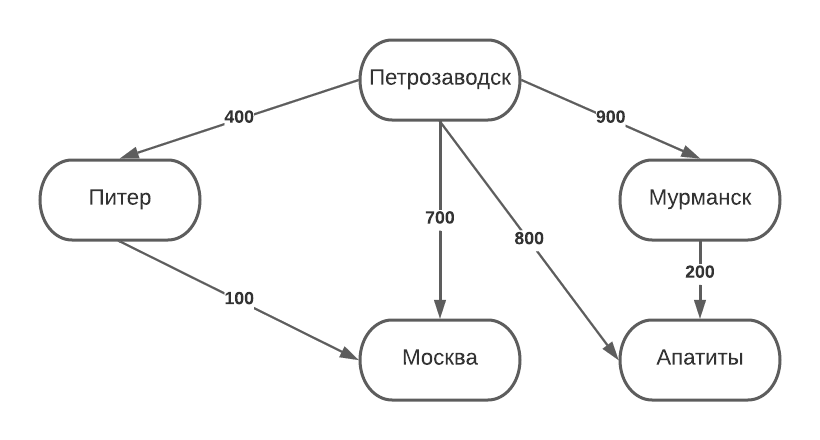
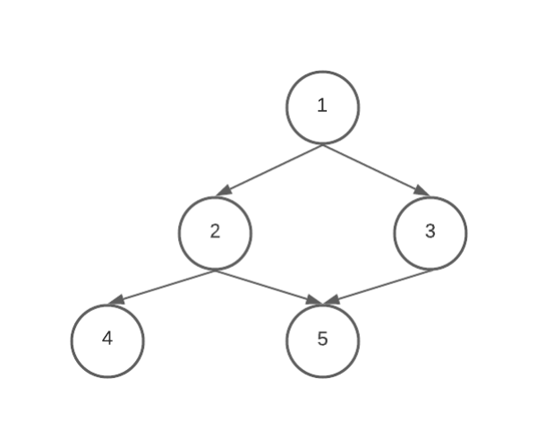

# Билет №4. Кратчайшие пути в графе. Поиск кратчайших путей в бесконтурном графе (алгоритм Лоулера). 

**Краткое описание:** задача поиска кратчайчаших путей на графе имеет широкое применения, к примеру, поиск кратчайшей дороги на карте, поиск кратчайшего пути к компьютерному узлу и т.п..

**Полное описание:** задача поиска кратчайшего пути на графе широко используется при определении наименьшего расстояния в сети дорог, при поиске путей между узлами компьютерной сети, в других приложениях в различных областях. В различных задачах роль веса ребра могут играть время, стоимость, расходы, объём затрачиваемых ресурсов или другие характеристики, связанные с прохождением ребра. Также имеет спрос задача о поиске k-ых кратчайших путей, к примеру на картах при построении маршрута дополнительно могут строиться ещё несколько более длинных путей.

## Основные термины и обозначения

- **Граф** $G = (V, E)$ – это совокупность двух множеств: множества вершин $V$ и множества ребер 
$E$, состоящего из неупорядоченных пар различных элементов множества $V$: 
$E ⊂ \lbrace ( u, v ) | u, v ∈ V \rbrace $;
- $D[v]$ – оценка веса кратчайшего пути из вершины $s$ в вершину v (D[v] ≥ δ(s, v))
- $\pi[v]$ – вершина, предшествующая вершине $v$ в пути из $s$.
- **Контур** - циклический путь (цикл).

## Введение в теорию поиска кратчайших путей в графе.

Пусть дан граф $G = (V, E)$ с вещественной весовой функцией $d$ : $E \rightarrow R$(у каждого ребра есть вес).
Весом пути $p = \lbrace v_0, v_1, \cdots , v_k \rbrace $ называется сумма весов дуг, входящих в этот путь: $\displaystyle d(p) = \sum_{i = 1}^{k}d(v_{i-1}, v_i)$
 
Вес кратчайшего пути из вершины u в вершину v:

$$ δ(u, v) = 
\begin{cases}
  min  \lbrace d(p): u\stackrel{p}{\leadsto} v \rbrace, \text{ если существует путь } p,\\      
  \infty \text{ иначе}
\end{cases}
$$

Т.е. кратчайший путь, это минимальный по весу из всех путей, если они есть.

Варианты задачи о кратчайшем пути.
 1. Кратчайшие пути из одной вершины.
 2. Кратчайшие пути в одну вершины.
 3. Кратчайший путь между данной парой
вершин.
 4. Кратчайшие пути между всеми парами
вершин.

В этом билете рассматривается 1 вариант.

Также задачу делят по типу графов:
 1. Графы без циклов (ацикличные).
 2. Графы без дуг отрицательного веса.
 3. Графы без контуров (циклов) отрицательного
веса.

В этом билете рассматривается  вид, 1 т.е. бесконтурные графы

## Псевдокод

**Граф, с которым работает данный алгоритм долежн быть топологически отсортирован!!!**
 
```python
for v ∈ V do                    # Для всех вершин в графе
 D[v] = +∞                      # Устанавливаем кратчайший путь равный бесконечности
 π[v] = 0                       # И вершину из которой пришли на неизвестную (нет родителя) 
D[s] = 0                        # Путь до начальной вершины равен нулю
for u = 1 to m do               # Для всех вершин начинаем обход в глубину
 for v ∈ Γ(u) do                # Для всех рёбер из этой вершины
  if D[v] > D[u] + d[u, v] then # Если на другой конец путь будет короче, чем тот, который там сейчас
   D[v] = D[u] + d[u, v]        # Обновить длину пути
   π[v] = u                     # Установить родителя для той вершины - текущую вершину
```

## Пример
 
 Допустим, мы хоти узнать, как быстрее добраться из Петрозводскка то некоторых их городов мира на основе некоторого орграфа. В системе они записаны по порядку: Петрозаводск, Питер, Москва, Мурманск, Апатиты.
 
 
 
 1. D[Петрозаводск] = 0, остальные D[] = $\infty$
 2. По алгоритму начнём рассматривать дуги от первой вершины - Петрозаводск. После этого D[Питер] = 400, D[Москва] = 700, D[Мурманск] = 900, D[Апатиты] = 800 и для этих городов π[] = Петрозаводск.
 3. После начнётся рассмотрение вершины Питер. Во время рассмотрения ребра Питер-Москва обнаружится, что D[Москва] > D[Питер] + d(Питер, Москва) (700 > 400 + 100). Тогда D[Москва] = D[Питер] + d(Питер, Москва) = 000 + 100 = 500, а π[Москва] = Питер.
 4. После начнётся рассмотрение вершин мурманск, но у неё нет исходящих рёбер, поэтому ничего не произойдёт.
 5. После начнётся рассмотрение верщины Мурманск. Обнаружится, что условие D[Апатиты] > D[Мурманск] + d(Мурманск, Апатиты) не соблюдается (800 > 900+200 неверно), тогда путь до вершины Апатиты не изменится, как и его родитель.
 6. После начнётся рассмотрение верщины Апатиты, но т.к. у неё нет исходящих рёбер, ничего не произойдёт.
 7. Все вершины были рассмотрены, в итоге вышло:
   
   D[Петрозаводска] = 0, π[Петрозаводска] = 0
   
   D[Питер] = 400, π[Питер] = Петрозаводск
   
   D[Москва] = 500, π[Москва] = Питер
   
   D[Мурманск] = 900, π[Мурманск] =  Петрозаводск
   
   D[Апатиты] = 800, π[Апатиты] =  Петрозаводск
 
## Временная сложность
Алгоритм выполняется за один обход в глубину, а значит оценка O: **O(V + E)**
 
## Доказательство работы

К примеру, есть граф, нужно найти пути от вершины 4



Если граф топологически отсортирован от вершины, с которой начинается путь (в примере это 1), то мы получим порядок вершин, которые будем обходить, в иерархическом порядке (сначала корень (1), потом соседи корня (2, 3), потом соседи соседей (4, 5) и т.д.). Тогда мы получим ситуацию, что перед рассмотрением вершины, до которой идёт ребро, для вершины, из которой оно исходит уже найден кратчайший путь, это даёт гарантию, что будет выбран кратчайший путь для дочерней вершины (на примере, перед рассмотрением рёбер к вершиные 5, уже будут известны кратчайшие пути до вершин из которых исходят эти рёбра (2 и 3), тогда в качестве пути до 5 будет выбран кратчайший из путей D[2]+d(2,5) и D[3]+d(3,5), логично, что это и будет кратчайший путь).
 

## Создатель

Автор расписанного билета: Курочкин Дима

Кто проверил:
- Квист Татьяна
- Смирнов Костя
- Топчий Евгений

## Ресурсы

 - [Презентация Воронова](https://moodle2.petrsu.ru/mod/resource/view.php?id=47301) слайды 71-80.
