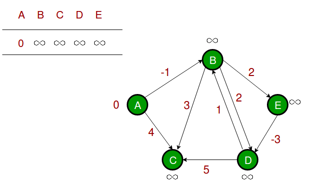
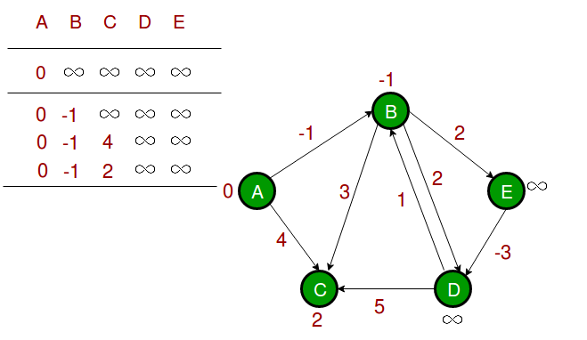
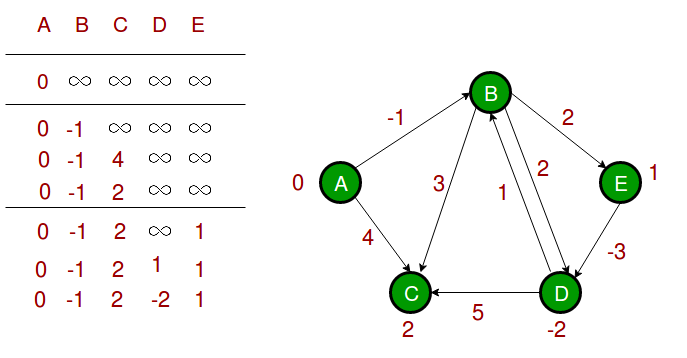

# Билет №5. Кратчайшие пути в графе. Алгоритм Форда – Беллмана.

**Краткое определение:** минимальное расстояние между вершиной А и вершиной B на графе.   
**Длинное определение:** задача поиска самого короткого пути между двумя вершинами на графе, в которой минимизируется сумма весов рёбер, составляющих путь.

## Основные термины и обозначения

- **Граф** $G = (V, E)$ – это совокупность двух множеств: множества вершин $V$ и множества ребер 
$E$, состоящего из неупорядоченных пар различных элементов множества $V$: 
$E ⊂ \lbrace ( u, v ) | u, v ∈ V \rbrace $;
- $D[v]$ – оценка веса кратчайшего пути из вершины $s$ в вершину v (D[v] ≥ δ(s, v))
- $\pi[v]$ – вершина, предшествующая вершине $v$ в пути из $s$.

## Введение в билет

Пусть дан граф $G = (V, E)$ с вещественной весовой функцией $d$ : $E \rightarrow R$.
Весом пути $p = \lbrace v_0, v_1, \cdots , v_k \rbrace $ называется сумма весов дуг, входящих в этот путь: $\displaystyle d(p) = \sum_{i = 1}^{k}d(v_{i-1}, v_i)$
 
Вес кратчайшего пути из вершины u в вершину v:

$$ δ(u, v) = 
\begin{cases}
  min  \lbrace d(p): u\stackrel{p}{\leadsto} v \rbrace, \text{ если существует путь } p,\\      
  \infty \text{ иначе}
\end{cases}
$$

Кратчайший путь из $u$ в $v$ – это любой путь $p$ из $u$ в $v$, для которого $d(p) = δ(u, v)$.

## Алгоритм

Основная особенность данного алгоритма: **не должно быть контуров (циклов) с отрицательным весом**.

Для хранения дерева кратчайших путей будем для каждой вершины v запоминать ее родителя $\pi[v]$ в дереве.  
Будем искать кратчайшие пути из вершины s во все вершины графа.  
В конце работы алгоритмов для всех вершин $v$, достижимых из вершины $s$, будет выполнено $D[v] = δ(s, v)$.


```python
for v ∈ V do  # Идём по всем вершинам
    D[v] = +∞ # Путь до каждой пока бесконечность
    π[v] = 0  # Родитель для каждой пока 0

D[s] = 0 # Ставим длину пути для первой 0
for i=1 to m − 1 do   # Идём по всем вершинам 
    for (u, v) ∈ E do # Берём вершины из ребра

        # Если кратчайшее расстояние до конечной (дочерней) вершины больше, чем кратчайшее  расстояние до родителя + расстояние между этими вершинами, то
        if D[v] > D[u] + d[u, v] then 
            D[v] = D[u] + d[u, v] # Присваиваем наименьшее расстояние (ту сумму)
            π[v] = u              # Обозначаем u как родителя для v
```

## Доказательство корректности работы алгоритма

<details>
  <summary>Материал для доказательства</summary>

  Тут будет использоваться функция `Relax`:  
  Процесс ослабления (_relaxation_) ребра $(u, v)$ заключается в проверке, нельзя ли улучшить найденный к этому моменту кратчайший путь к вершине $v$, проведя его через вершину $u$, а также в обновлении атрибутов $v.d$ и $v.\pi$ при наличии такой возможности. Ослабление может уменьшить оценку кратчайшего пути $v.d$ и обновить атрибут $v.\pi$ вершины $v$. Приведённый ниже код выполняет ослабление ребра $(u, v)$ за время $O(1)$.

  ```python
  Relax(u, v, w)
    if v.d > u.d + w(u,v)
        v.d = u.d + w(u,v)
        v.pi = u
  ``` 

  Ещё (блин) тут другой алгоритм:

  ```python
    for i = 1 to G.V -1 
        for каждого ребра (u,v) в G.E
        Relax(u, v, w)

    for каждого ребра (u,v) в G.E
        if v.d > u.d +w(u,v)
            return False

    return True 
  ```
</details>

Доказать корректность работы алгоритмов Лоулера и Беллмана – Форда можно при помощи математической индукции. 
Чтобы доказать корректность алгоритма Беллмана-Форда, сначала покажем, что при отсутствии циклов с отрицательным весом он правильно вычисляет веса кратчайших путей для всех вершин, достижимых из истока.

**Лемма.** Пусть $D = (V, E)$ является взвешенным ориентированным графом с истоком s и весовой функцией 
$\omega: E\to R$, который не содержит циклов с отрицательным весом, достижимых из вершины $s$. 
Тогда по завершении $|V| - 1$ итераций релаксации для всех вершин $v$, достижимых из вершины $s$, выполняется равенство $v.d = \delta(s, u)$

**Следствие.** Пусть $G = (V, E)$ является взвешенным ориентированным графом  с истоком $s$ и весовой функцией $\omega: E \to R$ и пусть граф G не содержит достижимых из s циклов с отрицательным весом. Тогда для каждой вершины $v \in V$ путь из вершины $s$ в вершину v существует тогда и только тогда, когда после применения к графу G алгоритма Беллмана-Форда выполняется равенство $v.d < \infty$

А теперь переходим к доказательству
### Доказательство 

Пусть алгоритм Беллмана-Форда применяется к взвешенному ориентированному графу $G = (V, E)$ с истоком $s$ и весовой функцией $\omega: E \to R$. Если граф G не содержит циклов с отрицательным весом, достижимых из s, то этот алгоритм возвращает значение `True` для всех вершин $v \in V$ выполняется равенство $v.d = \delta (s,v)$ и подграф предшествования $G_\pi$ является деревом кратчайших путей с корнем в вершине s. Если же граф G содержит цикл с отрицательным весом, достижимый из вершины s, то алгоритм возвращает значение `False`.

**Доказательство.** Предположим, что граф G не содержит циклов с отрицательным весом, достижимых из истока s. Сначала докажем, что по завершении работы алгоритма для всех вершин $v \in V$ выполняется равенство $v.d = \delta(s, v)$. Если вершина v достижима из истока s, то доказательством этого утверждения служит лемма, представленная выше. ЕСли же вершина v не достижима из вершины s, то это утверждение следует из свойства отсутствия пути.

> **Свойство отсутствия пути**    
> Если из вершины s в вершину v нет пути, то всегда выполняется соотношение $v.d = \delta(s, v) = \infty$

Таким образом, данное утверждение доказано. Из свойства подграфа предшествования и этого утверждения следует, что подграф $G_\pi$ - дерево кратчайших путей.

> **Свойство подграфа предшествования**  
> Если для всех вершин $v \in V$ выполняется равенство $v.d = \delta(s, v)$, то подграф предшествования представляет собой дерево кратчайших путей с корнем в истоке $s$.    

А теперь с помощью обоснованного выше покажем, что алгоритм возвращает `True`. По завершении работы алгоритма для всех ребер $(u, v) \in E$ выполняется соотношение

$$ v.d = \delta(s, v) \\
v.d \leq \delta(s, u) + w(u, v) \\
v.d = u.d + w(u, v) 
$$
согласно неравенству треугольника 

> **Неравенство треугольника**  
> Для каждого ребра $(u, v) \in E$ выполняется неравенство $\delta(s, v) \leq \delta(s, u) + w(u, v)$.

так что все проверки будут пройдены и алгоритм вернёт `True`.

Теперь предположим, что граф G содержит цикл с отрицательным весом, достижимый из истока s; пусть это будет цикл $c = \lbrace v_0, v_1, \cdots, v_k\rbrace$, где $v_0 = v_k$. Тогда $\displaystyle \sum_{i = 1}^{k}w(v_{i - 1}, v_i) < 0$ **(1)**.  
Чтобы всопользоваться методом "от противного" предположим, что алгоритм возвращает значение `True`. Тогда для значений $i = 1, 2,\cdots, k$ выполняются неравенства $v_i.d \leq v_{i-1}.d + w(v_{i-1},v_i)$. Просуммировав их по циклу $c$, получим

$$\displaystyle \sum_{i = 1}^kv_i.d\leq \sum_{i = 1}^k(v_{i-1}.d + w(v_{i - 1}, v_i)) = \sum_{i = 1}^kv_{i -1}.d + \sum_{i=1}^kw(v_{i-1}, v_i)
$$

Поскольку $v_0 = v_k$, каждая вершина в цикле $c$ в каждой сумме $\displaystyle \sum_{i=1}^kv_i.d$ и $\displaystyle \sum_{i=1}^kv_{i-1}.d$ появляется ровно по одному разу, так что 

$$\displaystyle \sum_{i=1}^kv_i.d=\sum_{i = 1}^kv_{i-1}.d$$

Кроме того, согласно следствию, приведённому выше, атрибут $v_i.d$ при $i = 1, 2,\cdots, k$ принимает конечные значения. Таким образом, справедливо неравенство 

$$\displaystyle 0\leq \sum_{i=1}^kw(v_{i-1}, v_i)
$$

что противоречит неравенству (1). Итак, мы подходим к выводу, что алгоритм возвращает значение `True`, если граф G не содержит циклов с отрицательным весом, достижимых из истока s, и значение `False` в противном случае.

## Пример

Давайте разберемся в алгоритме на следующем примере графа. Изображения взяты отсюда.
Пусть начальная вершина равна 0. Примите все расстояния за бесконечные, кроме расстояния до самой src. Общее число вершин в графе равно 5, поэтому все ребра нужно пройти 4 раза.



Пусть ребра отрабатываются в следующем порядке: (B, E), (D, B), (B, D), (A, B), (A, C), (D, C), (B, C), (E, D). Мы получаем следующие расстояния, когда проход по ребрам был совершен первый раз. Первая строка показывает начальные расстояния, вторая строка показывает расстояния, когда ребра (B, E), (D, B), (B, D) и (A, B) обрабатываются. Третья строка показывает расстояние при обработке (A, C). Четвертая строка показывает, что происходит, когда обрабатываются (D, C), (B, C) и (E, D).



Первая итерация гарантирует, что все самые короткие пути будут не длиннее пути в 1 ребро. Мы получаем следующие расстояния, когда будет совершен второй проход по всем ребрам (в последней строке показаны конечные значения).



Вторая итерация гарантирует, что все кратчайшие пути будут иметь длину не более 2 ребер. Алгоритм проходит по всем ребрам еще 2 раза. Расстояния минимизируются после второй итерации, поэтому третья и четвертая итерации не обновляют значения расстояний.

## Математическая модель (реккурентное соотношение)
Алгоритм Форда – Беллмана основан на методе ***динамического программирования***.  

После i-ой итерации D[v] содержит вес кратчайшего пути из s в v, содержащего не более i ребер.  Рекуррентное соотношение:
$D_i[v] = \min  \lbrace D_{i−1}[v], \displaystyle \min_{u \in V} \lbrace D_{i−1}[u] + d[u, v] \rbrace \rbrace$.

## Временная сложность 
Инициализация занимает $Θ(V)$ времени, 
каждый из $|V|−1$ проходов 
требует $Θ(E)$ времени, 
обход по всем ребрам для проверки наличия отрицательного цикла занимает $O(E)$ времени. 
Значит алгоритм Беллмана-Форда работает за $O(VE)$ времени.

---
## Создатель

Автор расписанного билета: Татьяна Квист

Кто проверил: 
- Топчий Евгений
- Смирнов Костя
- Курочкин Дима

## Ресурсы
- [Вики](https://ru.wikipedia.org/wiki/%D0%A2%D0%BE%D0%BF%D0%BE%D0%BB%D0%BE%D0%B3%D0%B8%D1%87%D0%B5%D1%81%D0%BA%D0%B0%D1%8F_%D1%81%D0%BE%D1%80%D1%82%D0%B8%D1%80%D0%BE%D0%B2%D0%BA%D0%B0)
- [Хабр | Алгоритм Беллмана-Форда](https://habr.com/ru/company/otus/blog/484382/)
- [Т.Кормен, Ч.Лейзерсон, Р.Ривест, К.Штайн - Алгоритмы. Построение и анализ.](https://vk.com/wall-54530371_2325)

