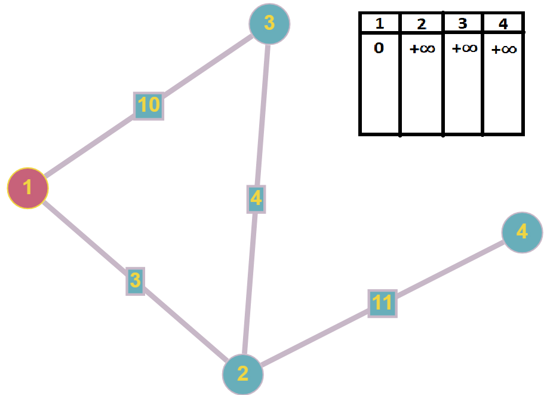

# Билет №6. Кратчайшие пути в графе. Алгоритм Дейкстры.

**Определение:** Поиск кратчайших путей в графе без ребер (дуг) с отрицательным весом.

## Основные термины и обозначения

- **Граф**: $G = (V, E)$ – это совокупность двух множеств: множества вершин $V$ и множества ребер $E$, состоящего из неупорядоченных пар различных элементов множества $V$: $E ⊂ ${ $ ( u, v ) | u, v ∈ V $};
- **Ориентированный граф**: $G = (V, E)$ – это совокупность двух множеств: множества вершин $V$ и множества дуг $E$, состоящего из упорядоченных пар различных элементов множества $V$: $E ⊂ (V \times V) \ I, I =  $ { $ (v, v) | v \in V $ };
- **Алгоритм Дейкстры**. Метод, который находит кратчайший путь от одной вершины графа к другой.
- $D[v]$ – оценка веса кратчайшего пути из вершины $s$ в вершину $v$ ($D[v] \geq δ(s, v)$)
- $\pi[v]$ – вершина, предшествующая вершине $v$ в пути из $s$.
- Q – очередь с приоритетом, состоящая из вершин, с операцией удаления вершины с наименьшим значением D[v].

Дополнительные определения:
- **Плотный граф** — граф, в котором число рёбер $E$ близко к максимально возможному у полного графа с числом $V$ вершин: 
$\displaystyle E = \frac{V(V-1)}{2}$.
- Граф, имеющий малое число рёбер, принято называть **разреженным графом**.


## Введение в билет

Пусть дан граф $G = (V, E)$ с вещественной весовой функцией $d$ : $E \rightarrow R$.
Весом пути $p = $ {$ v_0, v_1, \cdots , v_k$ } называется сумма весов дуг, входящих в этот путь: $\displaystyle d(p) = \sum_{i = 1}^{k}d(v_{i-1}, v_i)$
 
Вес кратчайшего пути из вершины u в вершину v:

$$ δ(u, v) =  \begin{cases}
  min  \lbrace d(p): u\stackrel{p}{\leadsto} v \rbrace, \text{ если существует путь } p,\\      
  \infty \text{ иначе}
\end{cases}
$$

Кратчайший путь из $u$ в $v$ – это любой путь $p$ из $u$ в $v$, для которого $d(p) = δ(u, v)$.

## Алгоритм Дейкстры
Шаг 1: Выбираем вершину, из которой будем искать кратчайшие расстояния до остальных вершин  
Шаг 2: Выбираем наикратчайшее расстояние из всех расстояний  
Шаг 3: Выбираем вершиной, из которой будем искать кратчайшие расстояния до остальных вершин, ту, в которую ведет наикратчайший путь.  
Шаг 4: Ищем кратчайшие пути к вершинам, путь будет кратчайшим, если сумма кратчайшего расстояния до текущей вершины и кратчайшего расстояния до выбранной вершины меньше уже найденного расстояния до выбранной вершины.


## Псевдокод

```python
for v ∈ V do # Идём по всем вершинам
  D[v] = +∞  # Сначала расстояния до всех вершин делаем равными +∞
  π[v] = 0
  
D[v] = 0     # Далее первой вершине присваиваем ноль 
Q = V        # Очередь из всех вершин

while Q != ∅ do                  # Пока очередь не пустая
  u = DeleteMin(Q)                # "Выбираем" меньшую вершину и извлекаем ее из очереди
  for v ∈ Γ(u) ∩ Q do             # Для смежных с выбранной вершин, которые все еще в очереди
    if D[v] > D[u] + d[u,v] then  # Если найденный путь до вершины меньше изначального
      D[v] = D[u] + d[u,v]        # То запоминаем его
      π[v] = u            
```

## Пример 


Шаг 1: Выбираем вершину, из которой будем искать кратчайшие расстояния до остальных вершин


Шаг 2: Выбираем наикратчайшее расстояние из всех расстояний


Шаг 3: Выбираем вершиной, из которой будем искать кратчайшие расстояния до остальных вершин, ту, в которую ведет наикратчайший путь.


Шаг 4: Ищем кратчайшие пути к вершинам, путь будет кратчайшим, если сумма кратчайшего расстояния до текущей вершины и кратчайшего расстояния до выбранной вершины меньше уже найденного расстояния до выбранной вершины.


## Временная сложность

- Если для представления графа используется матрица смежности:
$O(m^2)$

- Если для представления графа используются списки смежности, а для очереди с приоритетом Q – двоичная куча:
$O(n * log(m))$

- При этом для разреженных графов $n = Θ(m)$, $F_2 = O(m \log m)$ и $F_2 < F_1$. 
- Для плотных графов $n = Θ(m^2)$, $F_2 = O(m^2 \log m) и $F_2 > F_1$. 

**Таким образом, для плотных графов выгоднее использовать матрицу смежности графа (матрицу весов).**

## Обоснование алгоритма Дейктстры.

Обозначим $δ(v)$ – вес кратчайшего пути из вершины $s$ в вершину $v$ ($δ(v) = δ(s, v)$). Докажем по индукции, что в момент посещения любой вершины $u$,
$D[u] = δ(u)$.

_База_. Первой посещается вершина $s$. В этот момент $D[s] = δ(s) = 0$.   
_Индуктивное предположение_. Пусть предположение верно до некоторого шага алгоритма.  
_Шаг индукции_. Пусть мы выбрали для посещения вершину $u \neq s$. Докажем, что в этот момент $D[u] = δ(u)$. 
Для начала отметим, что для любой вершины $v$, всегда выполняется $D[v] \geq δ(v)$ (алгоритм не может найти путь короче, чем кратчайший из всех существующих). 
Пусть $p$ - кратчайший путь из $s$ в $u$, $y$ - первая непосещенная вершина на $p$, $x$ – предшествующая ей (следовательно, посещенная). 
Поскольку путь $p$ кратчайший, его часть, ведущая из $s$ через $x$ в $y$, 
тоже кратчайшая, следовательно $δ(y) = δ(x) + d[x,y]$.  

По предположению индукции, в момент посещения вершины $x$ выполнялось $D[x] = δ(x)$, следовательно, вершина y тогда получила оценку $D[y]$ не больше чем $D[x] + d[x, y] = δ(x) + d[x, y] = δ(y)$. Следовательно, $D[y] = δ(y)$. С другой стороны, поскольку сейчас мы выбрали вершину $u$, ее оценка минимальна среди непосещенных, то есть $D[u] ≤ D[y] = δ(y) ≤ δ(u)$. Комбинируя это с $D[u] \geq δ(u)$, имеем $D(u) = δ(u)$, **что и требовалось доказать**. 

Поскольку алгоритм заканчивает работу, когда все вершины посещены, в этот момент $D[v] = δ(v)$ для всех вершин.

## Создатель

Автор расписанного билета: Топчий Женя и Смирнов Костя

Кто проверил: 
- Квист Татьяна
- Курочкин Дима
- Клюшов Никита

## Ресурсы
- Презентация Воронова, слайды 84 - 86 (https://moodle2.petrsu.ru/mod/resource/view.php?id=47301)
 
