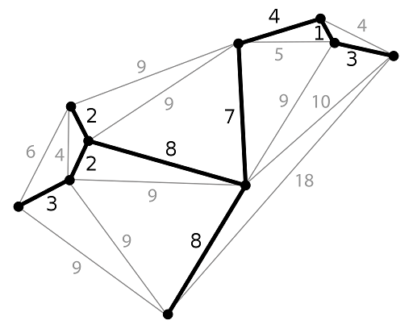
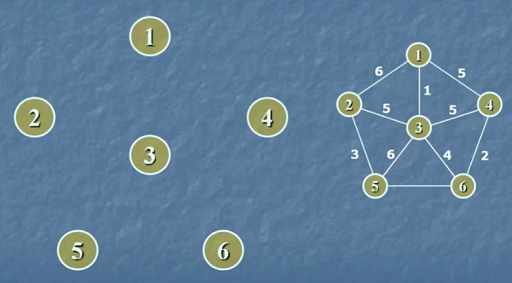
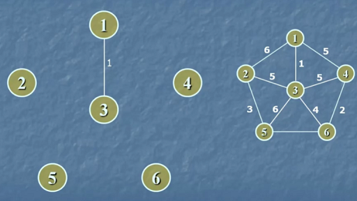
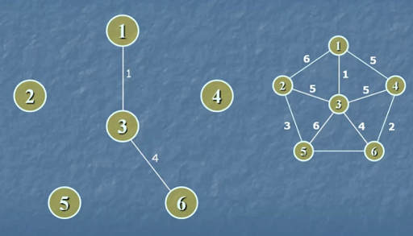
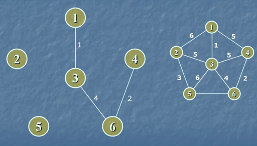
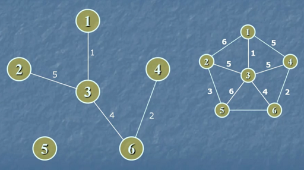
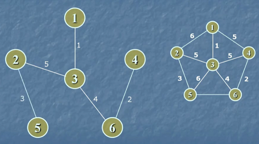

# Билет №8. Минимальное покрывающее дерево. Алгоритм Прима.

**Граф:** связный неориентированный взвешенный.

**Задача о нахождении минимального покрывающего дерева часто встречается в подобной постановке:** есть n городов, которые необходимо соединить дорогами, так, чтобы можно было добраться из любого города в любой другой (напрямую или через другие города). Разрешается строить дороги между заданными парами городов и известна стоимость строительства каждой такой дороги. Требуется решить, какие именно дороги нужно строить, чтобы минимизировать общую стоимость строительства. 

## Основные термины

- **Покрывающее дерево (остов)** – подграф графа $G$, являющийся деревом и содержащий все вершины графа $G$. Вес покрывающего дерева равен сумме весов его ребер.
- **Минимальное покрывающее дерево** – покрывающее дерево, имеющее минимальный вес.



## Алгоритм Прима

Сначала множество $U$ вершин дерева состоит из одной (любой) вершины. Затем на каждом шаге алгоритма находится ребро минимального веса такое, что одна его вершина входит в дерево, а другая нет, и добавляется в дерево. Это процесс продолжается до тех пор, пока дерево не будет включать все вершины графа.

## Обозначения

- $π[v]$ – вершина множества $U$, ближайшая к вершине $v \in V \setminus U$
- $D[v]$ – стоимость ребра $(v, π[v])$
- $Q$ – очередь с приоритетом, элементы – вершины, ключи – $D[v], v \in V \setminus U$
- $s$ – вершина, с которой начинается построение дерева

## Псевдокод

```python
for u ∈ V do    # Для всех вершин графа
  D[u] = +∞     # Расстояние делаем максимально возможным
  π[v] = 0      # Нет предыдущей вершины до нашей
D[s] = 0        # Путь до первой вершины - 0
Q = V           # Очередь из всех вершин
while Q != ∅ do             # Пока очередь не пуста - есть вершины
  u = DeleteMin(Q)          # Выбираем наименьшую вершину
  for v ∈ Γ(u) ∩ Q          # Для всех смежных вершин, которые в очереди
    if D[v] > d[u, v] then  # Если расстояние до вершины больше, чем между вершинами
      D[v] = d[u, v]        # То меняем его
      π[v] = u              # И меняем предыдущую вершину
```

В конце работы алгоритма множество ребер дерева:

$T = \{(v,π[v]) : v \in V \setminus \{s\}\}$

То есть в конце алгортма у нас есть пары - вершина и предыдущая для нее вершина, не считая первой.

## Пример 

*Условие:* Рассмотрим граф из шести вершин и по алгоритму составим минимальное покрывающее дерево.



*Решение:*

1. Возьмем первую вершину и добавляем в множество $U$, далее ищем вершину, связанную ребром с минимальным весом и не входящую в $U$, - в нашем случае вершина 3. Добавляем ее в $U$.  
  По алгоритму: $D[3] = 1, π[3] = 1$
  
  
  
2. Теперь в $U$ две вершины - 1 и 3. Ищем следующую вершину, связанную с 1 или 3 ребром с минимальным весом. Теперь это вершина 6. Добавляем ее в $U$.   
  По алгоритму: $D[6] = 4, π[6] = 3$
  
  
  
4. Далее проходим по графу, пока все вершины не окажутся в множестве $U$.
  
   
  
  

*Ответ:* На предыдущем рисунке нарисованы ребра входящие в минимальное покрывающее дерево.

## Временная сложность

Время работы алгоритма от $O(m^2)$ до $O(n\space log\space m)$. Для полных графов или где количество рёбер примерно равно квадрату количеству вершин лучше применять данный алгоритм.

## Обоснование алгоритма

G = (V, E) – связный взвешенный неориентированный граф.  
A – подмножество ребер некоторого минимального покрывающего дерева (МПД) графа G.  
U – множество вершин растущего дерева.  

***Утверждение***

Пусть U ⊂ V, при этом не существует ребра ($\tilde{u}, \tilde{v}$) ∈ A, для которого $\tilde{u} ∈ U, \tilde{v} ∈ V \setminus U$.  
Пусть (u, v) – ребро наименьшего веса в графе G, для которого u ∈ U, v ∈ V \ U.  
Тогда для графа G существует МПД, содержащее A и ребро (u, v).  

***Доказательство от противного***

По условию найдется хотя бы одно МПД, содержащее A. Но пусть существует МПД T, содержащее A, не содержащее ребро (u, v) и вес T строго меньше веса любого покрывающего дерева, содержащего A и ребро (u, v).

Тогда добавление ребра (u, v) к дереву T порождает цикл. Этот цикл содержит ребро (u, v) и другое ребро (u', v'), для которого u' ∈ U, v' ∈ V \ U. Удаление ребра (u', v') приводит к разрыву цикла и образованию покрывающего дерева T', чей вес, не выше, чем вес дерева T, так как d[u, v] ≤ d[u', v']. При этом T' содержит множество ребер A и ребро (u, v). Получаем противоречие.

---
## Создатель

Автор расписанного билета: Алиса Хайдарова

Кто проверил: 
- Смирнов Костя
- Топчий Женя
- Квист Татьяна

## Ресурсы
- Лекции Воронова
- [Вики](https://ru.wikipedia.org/wiki/%D0%9C%D0%B8%D0%BD%D0%B8%D0%BC%D0%B0%D0%BB%D1%8C%D0%BD%D0%BE%D0%B5_%D0%BE%D1%81%D1%82%D0%BE%D0%B2%D0%BD%D0%BE%D0%B5_%D0%B4%D0%B5%D1%80%D0%B5%D0%B2%D0%BE)
- [YouTube](https://www.youtube.com/watch?v=vPHUm874EoA)
