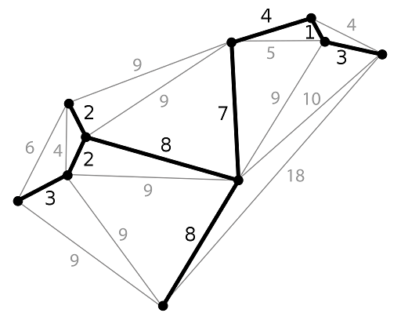
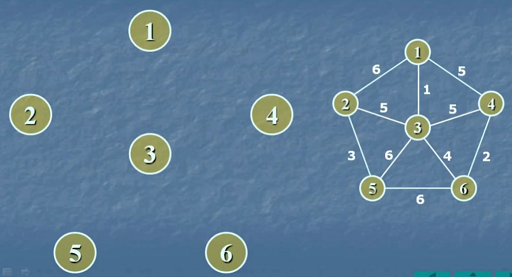
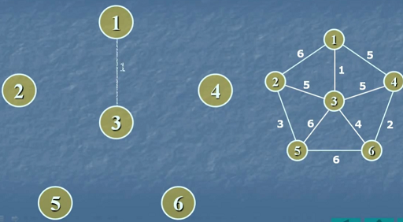
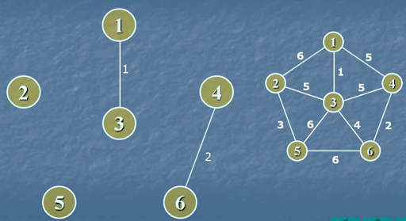
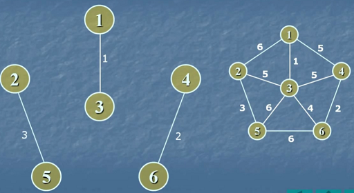
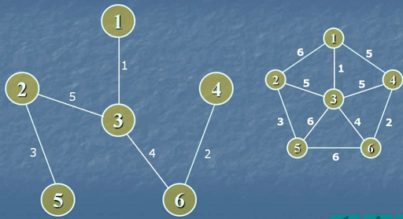

# Билет №9. Минимальное покрывающее дерево. Алгоритм Крускала.

**Граф:** связный неориентированный взвешенный.

**Задача о нахождении минимального покрывающего дерева часто встречается в подобной постановке:** есть n городов, которые необходимо соединить дорогами, так, чтобы можно было добраться из любого города в любой другой (напрямую или через другие города). Разрешается строить дороги между заданными парами городов и известна стоимость строительства каждой такой дороги. Требуется решить, какие именно дороги нужно строить, чтобы минимизировать общую стоимость строительства.

## Основные термины

- **Покрывающее дерево (остов)** – подграф графа $G$, являющийся деревом и содержащий все вершины графа $G$. Вес покрывающего дерева равен сумме весов его ребер.
- **Минимальное покрывающее дерево** – покрывающее дерево, имеющее минимальный вес.



## Алгоритм Крускала

Изначально каждая вершина образует отдельную компоненту, дерево пусто. В ходе алгоритма перебираются ребра в порядке возрастания их веса. Если ребро инцидентно вершинам из разных компонент, то оно добавляется в дерево, а соответствующие компоненты объединяются в одну.

## Обозначения

- $T$ – множество ребер, образующих минимальное остовное дерево
- $Q$ – очередь с приоритетом, ключи – веса ребер
- $C$ – набор компонент (система непересекающихся множеств) с операциями 
- $Init (C, v)$ – создание компоненты $\{v\}$
- $Find (C, v)$ – поиск компонеты, содержащей $v$
- $Merge (C, u, v)$ – слияние двух различных компонент, содержащих $u$ и $v$. 

## Псевдокод

```python
for u ∈ V do      # Для всех вершин
  Init(C, v)      # создаем компоненту
m = |V|           # Обозначаем количество ребер
for e ∈ E do      # Для все ребра
  Insert(Q, e)    # добавляем в очередь
T = ∅             # Обнувляем множество $T$
while m > 1 do                       # Пока есть вершины
  (u, v) = Deletemin(Q)              # вынимаем ребро с наименьшим весом
  if Find(C, u) != Find(C, v) then   # Если вершины ребра в разных компонентах
    Merge(C, u, v)                   # соединяем их компоненты
    m = m - 1                        # отнимаем единицу от $m$
    Insert(T, (u, v))                # добавляем наше ребро в множество $T$
```

## Пример 

*Условие:* Рассмотрим граф из шести вершин и по алгоритму составим минимальное покрывающее дерево.



*Решение:*

1. Рассматриваем ребро с наименьшим весом - 1-3. Вершины в разных компонентах, поэтому можем наше ребро выделить как часть покрывающего деорева.
  
  
  
2. Ищем следующее подходящее ребро. Это 4-6. Вес ребра наименьший и вершины в разных компонентах.
  
  
  
3. По такой же схеме находим оставшиеся ребра.
  
  
  
  

*Ответ:* На предыдущем рисунке нарисованы ребра входящие в минимальное покрывающее дерево.

## Временная сложность

Время работы алгоритма $O(n\space log\space n)$. Лучше применять, когда количество рёбер примерно равно количеству вершин.

## Обоснование алгоритма

$G = (V, E)$ – связный взвешенный неориентированный граф.  
$A$ – подмножество ребер некоторого минимального покрывающего дерева (МПД) графа $G$.  
$U$ – множество вершин любой одной из сливаемых компонент.  

***Утверждение***

Пусть U ⊂ V, при этом не существует ребра ($\tilde{u}, \tilde{v}$) ∈ A, для которого $\tilde{u} ∈ U, \tilde{v} ∈ V \setminus U$.  
Пусть (u, v) – ребро наименьшего веса в графе G, для которого u ∈ U, v ∈ V \ U.  
Тогда для графа G существует МПД, содержащее A и ребро (u, v).  

***Доказательство от противного***

По условию найдется хотя бы одно МПД, содержащее A. Но пусть существует МПД T, содержащее A, не содержащее ребро (u, v) и вес T строго меньше веса любого покрывающего дерева, содержащего A и ребро (u, v).

Тогда добавление ребра (u, v) к дереву T порождает цикл. Этот цикл содержит ребро (u, v) и другое ребро (u', v'), для которого u' ∈ U, v' ∈ V \ U. Удаление ребра (u', v') приводит к разрыву цикла и образованию покрывающего дерева T', чей вес, не выше, чем вес дерева T, так как d[u, v] ≤ d[u', v']. При этом T' содержит множество ребер A и ребро (u, v). Получаем противоречие.

---
## Создатель

Автор расписанного билета: Алиса Хайдарова

Кто проверил: 
- Лисицкий Олег
- Квист Татьяна

## Ресурсы
- Лекции Воронова
- [Вики](https://ru.wikipedia.org/wiki/%D0%9C%D0%B8%D0%BD%D0%B8%D0%BC%D0%B0%D0%BB%D1%8C%D0%BD%D0%BE%D0%B5_%D0%BE%D1%81%D1%82%D0%BE%D0%B2%D0%BD%D0%BE%D0%B5_%D0%B4%D0%B5%D1%80%D0%B5%D0%B2%D0%BE)
- [YouTube](https://www.youtube.com/watch?v=mPObw3cJoTs)
